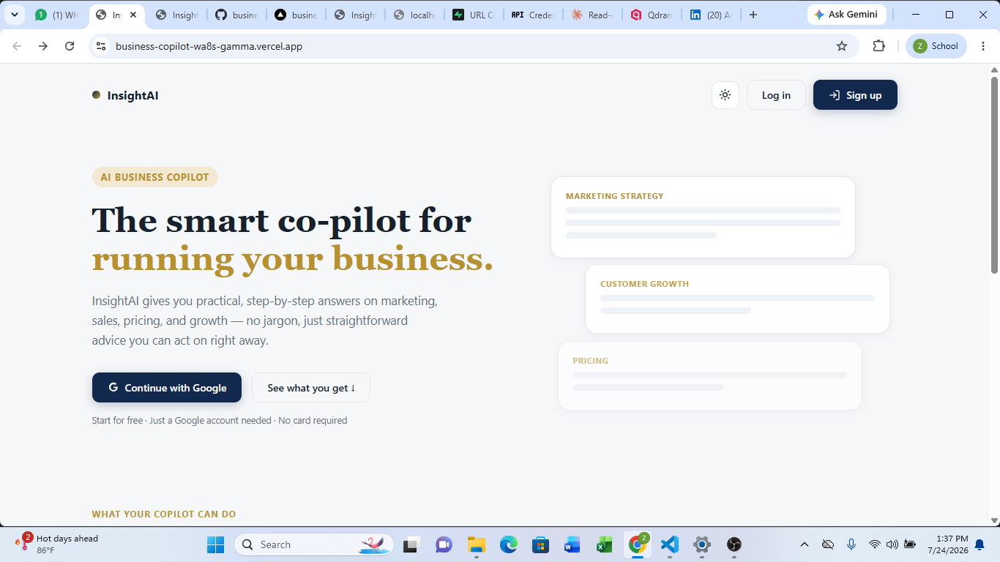
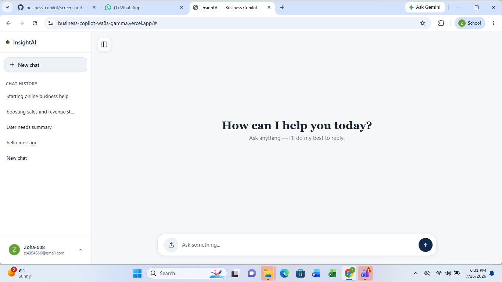
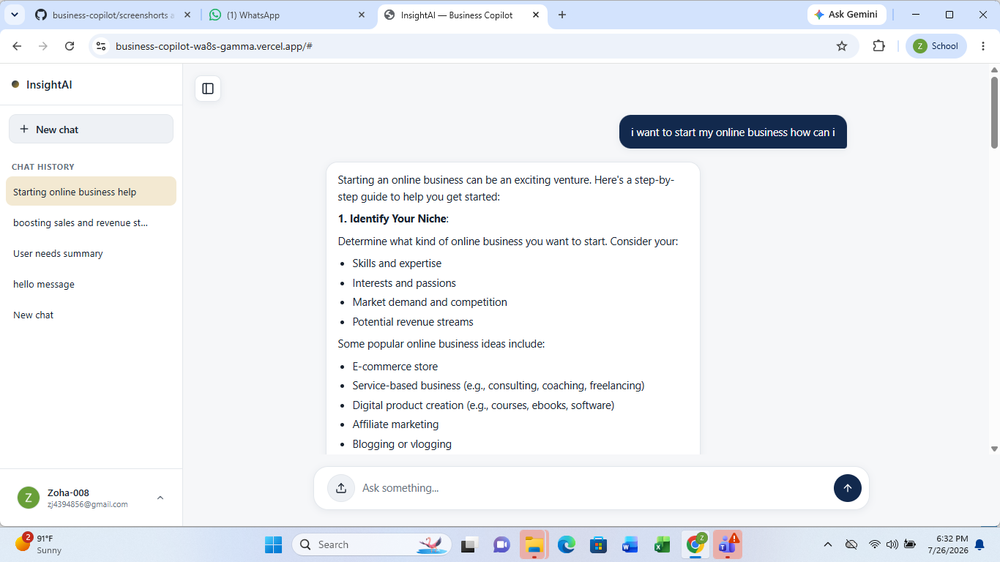
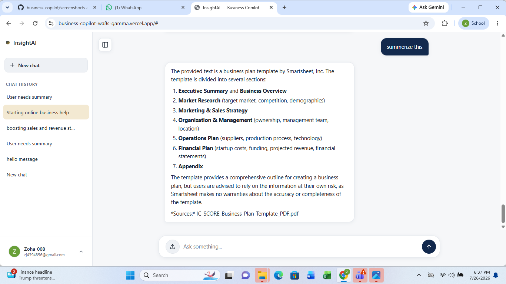

# 🚀 AI Business Copilot

An AI-powered Business Copilot that helps entrepreneurs, students, and small business owners retrieve business knowledge, analyse information, and receive intelligent, context-aware responses using *Vector RAG* and *Graph RAG*.

---

## 📌 Problem Statement

Businesses often store valuable information in PDFs, reports, manuals, and documentation. Searching through these documents manually is time-consuming and inefficient.

*AI Business Copilot solves* this problem by allowing users to ask questions in natural language and receive accurate, AI-generated answers based on their business knowledge base instead of relying only on the model's general knowledge.

---

# 💡 Project Reflection

The main vision behind building AI Business Copilot was not just to create another chatbot, but to explore how AI can help businesses better understand and utilize their information.

By combining Vector RAG and Graph RAG, the goal was to make AI more context-aware — helping users retrieve relevant insights, connect information, and get more meaningful responses from their business data.

This project strengthened my belief that the future of AI is not only about generating answers, but about building intelligent systems that can solve real-world problems.

## 🎯 Target Users

- 👨‍💼 Entrepreneurs
- 🏢 Small Business Owners
- 🚀 Startup Founders
- 🎓 Students
- 💻 AI & Business Learners

---

# 🌟 Features

- 🤖 AI Business Chat Assistant
- 📄 Business Knowledge Base
- 🔍 Vector RAG Retrieval
- 🧠 Graph RAG for Connected Knowledge
- 💬 Context-Aware Conversations
- 📚 Semantic Search
- 🔐 Google OAuth Authentication
- 🕒 Chat History
- ⚡ FastAPI Backend
- 🎨 Responsive React Frontend
- ☁️ Live Deployment

---

# 💡 Why This Project is Different

Unlike traditional chatbots, AI Business Copilot combines *Vector RAG* and *Graph RAG* to retrieve relevant information, understand relationships between business concepts, and generate more context-aware responses.

This helps users receive accurate answers grounded in their business knowledge base rather than relying solely on a language model's general knowledge.

---

# 🤖 AI Feature

The core intelligence of AI Business Copilot combines:

- Vector Retrieval-Augmented Generation (Vector RAG)
- Graph Retrieval-Augmented Generation (Graph RAG)
- Large Language Model (LLM)

The application follows a Retrieval-Augmented Generation architecture where relevant information is retrieved from the knowledge base before generating responses.

This makes responses more accurate, relevant, and trustworthy.

---

# 🧠 System Prompt

text
You are an intelligent AI Business Copilot.

Your role is to assist users with business-related questions using the retrieved business documents.

Always answer using the retrieved context whenever available.

Provide clear, concise, and professional responses.

If sufficient information is not available, politely state that the answer could not be found in the knowledge base instead of generating inaccurate information.

Use Graph RAG relationships whenever available to improve reasoning.

---

# 🛠️ Tech Stack

## Frontend

- React
- HTML
- CSS
- JavaScript

## Backend

- FastAPI
- Python

## AI

- Large Language Model (LLM)
- Vector RAG
- Graph RAG

## Vector Database

- Qdrant

## Authentication

- Google OAuth

## AI Libraries

- LangChain
- Embedding Models
- Vector Search

## Deployment

- Vercel (Frontend)
- Backend Hosting

---

# 📸 Screenshots

## 🏠 Home Page

---

## 💬 Chat Interface

---

## 🤖 AI Response

---

## 📄 Knowledge Base / PDF Processing

---
# 🌐 Live Demo

 live application link here.
https://business-copilot-wa8s-gamma.vercel.app/
---

# 📂 Project Structure

text
AI-Business-Copilot
│
├── frontend
├── backend
├── screenshots
├── requirements.txt
├── README.md
└── .env.example

---

# ⚙️ Installation

## Clone Repository

bash
git clone https://github.com/USERNAME/REPOSITORY.git

## Backend

bash
cd backend

pip install -r requirements.txt

uvicorn main:app --reload

## Frontend

bash
cd frontend

npm install

npm run dev

---

# 🔒 Environment Variables

Create a .env file.

env
LLM_API_KEY=

QDRANT_URL=

QDRANT_API_KEY=

GOOGLE_CLIENT_ID=

GOOGLE_CLIENT_SECRET=

⚠️ Never commit secrets or API keys to GitHub.

---

# 🚀 Future Improvements

- Voice Assistant
- Business Dashboard
- Multiple Knowledge Bases
- Multi-language Support
- File Upload from UI
- Better Analytics
- Mobile Version

---

# 👩‍💻 Author

*Zoha Javed*

AI Engineer

---

# ⭐ Acknowledgements

This project was developed as part of my AI Engineering learning journey to explore modern AI application development using Retrieval-Augmented Generation (RAG), Graph RAG, Large Language Models (LLMs), and FastAPI.

I would like to acknowledge the learning opportunities, guidance, and resources that helped me understand and implement advanced AI concepts and build practical AI-powered applications.
